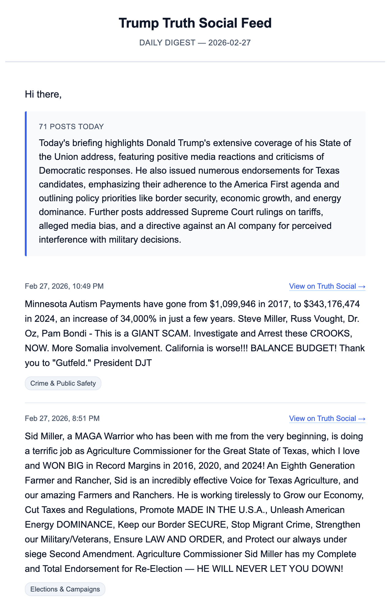

# trump-truth-social-feed

[](https://github.com/dfangafk/trump-truth-social-feed/actions/workflows/daily_ingest.yml)

## About

If you read Trump's posts for any reason, and are tired of manually checking Truth Social. This tool is for you - no account, no ads, no endless scrolling.

Self-hosted pipeline that fetches Trump's Truth Social posts, enriches them with an LLM (categorization, summarization), and emails yourself a daily digest. Runs once daily via GitHub Actions.

Posts are sourced from a third-party archive (not the Truth Social directly).

It is not affiliated with, endorsed by, or connected to Truth Social, Trump Media & Technology Group, or Donald Trump.

## Prefer a Managed Version?

Visit **[truth-feed.com](https://www.truth-feed.com/)** to subscribe and receive the daily digest — no API keys, no server setup, no maintenance required.

## What You'll Receive

<p align="center"></p>

---

## Getting Started

### Prerequisites

- Python 3.12+
- [`uv`](https://docs.astral.sh/uv/) package manager
- An API key for any [LiteLLM-supported provider](https://docs.litellm.ai/docs/providers) (OpenAI, Anthropic, Gemini, and many others) — or `claude` / `codex` CLI on PATH for local testing
- A Gmail account with an [App Password](https://myaccount.google.com/apppasswords) (optional — only needed for email delivery)

### Setup

**To run via GitHub Actions (recommended):** Fork this repo first, then clone your fork

```bash
git clone https://github.com/<your-username>/trump-truth-social-feed.git
cd trump-truth-social-feed
uv sync
cp .env.example .env
```

**To run locally only:** Clone directly

```bash
git clone https://github.com/dfangafk/trump-truth-social-feed.git
cd trump-truth-social-feed
uv sync
cp .env.example .env
```

### Configuration

All configuration is via environment variables or a `.env` file (never committed). Copy `.env.example` and fill in what you need:

**LLM enrichment** (optional):
- Set an API key for any [LiteLLM-supported provider](https://docs.litellm.ai/docs/providers). Common keys: `OPENAI_API_KEY`, `ANTHROPIC_API_KEY`, `GEMINI_API_KEY`
- Default models: `gemini/gemini-3-flash-preview` and `gemini/gemini-2.5-flash` (via LiteLLM). Override with `LLM__MODELS`
- The model prefix determines which API key is needed — e.g., `gemini/` models require `GEMINI_API_KEY`
- To skip enrichment: `PIPELINE__ENABLE_LLM=false`

**Email** (optional):
- Set `SENDER_GMAIL`, `GMAIL_APP_PASSWORD`, and `RECEIVER_EMAIL`
- To skip email: `PIPELINE__ENABLE_NOTIFY=false`

Refer to `.env.example` for available settings and `ttsfeed/config.py` for their defaults.

### Run locally

```bash
uv run python -m ttsfeed.pipeline
```

The pipeline logs progress to the console and writes output to `data/` by default:

- `data/raw/YYYY-MM-DD.json` — raw posts fetched from the archive
- `data/enriched/YYYY-MM-DD.json` — posts with LLM-generated categories and summary
- `data/logs/YYYY-MM-DD.log` — pipeline run log

To disable file output, set the `PIPELINE__SAVE_*` flags to `false`.

### Deploy via GitHub Actions

The included workflow (`.github/workflows/daily_ingest.yml`) runs daily at 12:00 UTC. To deploy (requires a fork — see Setup above):

1. Go to Settings → Secrets and variables → Actions
2. Add the secrets you need: an LLM API key if using LLM enrichment, and `SENDER_GMAIL`, `GMAIL_APP_PASSWORD`, `RECEIVER_EMAIL` if using email notifications
3. Enable Actions — the workflow runs automatically from then on

---

## FAQ

1. **Why not just read Truth Social directly?**
   You absolutely can, and if you're already comfortable doing that, you may not need this project. The value here is twofold: first, a daily digest means you don't have to check Truth Social regularly — it comes to you. Second, LLM-generated categorization and summaries make it faster to scan and pull out the relevant information without reading every post in full.

2. **Where does the data come from?**
   The [stiles/trump-truth-social-archive](https://github.com/stiles/trump-truth-social-archive) dataset, updated every five minutes.

3. **Why do I receive the email at a different time each day?**
   The pipeline runs on GitHub Actions, which schedules jobs at a fixed UTC time but queues them based on available runner capacity. During busy periods, your job may sit in the queue for several minutes to over an hour before it starts — so delivery time can vary day to day.
